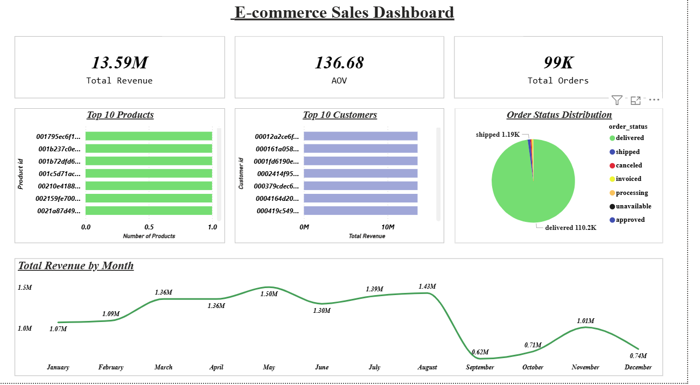

# 📊 E-commerce Sales Data Analysis

## 👩‍💻 Author
Priyanka | Aspiring Data Analyst

---

## 🚀 Project Overview
This project focuses on analyzing e-commerce sales data using SQL, Python, and Power BI to extract meaningful business insights and build an interactive dashboard.

---

## 🛠️ Tools & Technologies
- SQL Server (Data Extraction & Joins)
- Python (Pandas, Matplotlib) for Data Analysis
- Power BI for Data Visualization

---

## 📂 Project Files
- 📓 Python Analysis: EDA(python)_e_commerse.ipynb  
- 📄 SQL Queries: SQLQuery_ecommerse_.sql  
- 📊 Dashboard Screenshot: e-commerse_dashboard_screenshot.png  

---

## 🔍 Key Analysis Performed
- Data cleaning and transformation using Python  
- SQL joins across multiple tables (orders, customers, products, payments)  
- Monthly revenue trend analysis  
- Identification of top customers and products  
- Calculation of key metrics:  
  - Total Revenue  
  - Total Orders  
  - Average Order Value (AOV)  

---

## 📊 Dashboard

---

## 💡 Key Insights
- Identified monthly revenue trends and business growth patterns  
- Found top-performing products based on order volume  
- Identified high-value customers contributing to revenue  
- Analyzed overall sales performance  

---

## 📌 Project Highlights
- End-to-end data analysis project  
- Real-world dataset handling  
- Business-focused insights generation  

---

## 🧠 Learnings
- Hands-on experience with SQL joins and aggregations  
- Data cleaning and analysis using Python (Pandas)  
- Data visualization and dashboard creation in Power BI  

---

## 📬 Contact
Feel free to connect with me for feedback or opportunities.
